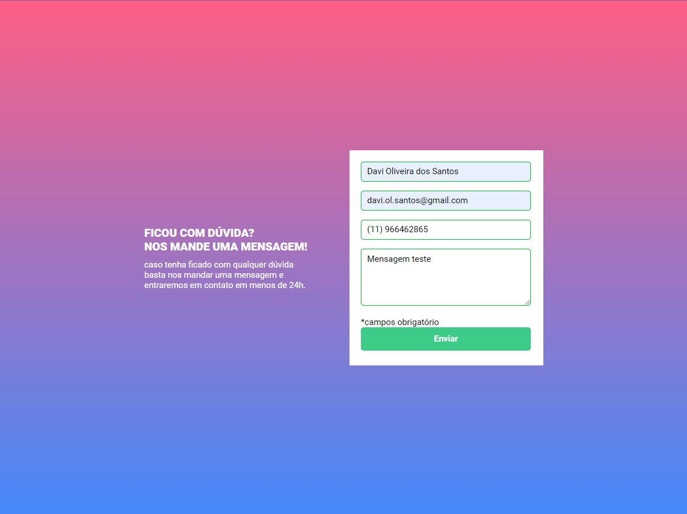

# Formulário com validação

Esse foi a resolução da **Quest HTML + CSS + JS intermediário - Desafio - Formulário com validação** do DevQuest

## Tabela de conteúdos

- [Visão geral](#visão-geral)
  - [Screenshots](#screenshots)
- [Meu processo](#meu-processo)
  - [Dificuldades e aprendizados](#dificuldades-e-aprendizados)
  - [Desenvolvido com](#desenvolvido-com)
- [Autor](#autor)

## Visão geral

### Screenshots

#### Design do desktop

#### Design do desktop com input inválido

#### Design do desktop com input válido

#### Design Mobile

### Dificuldades e aprendizados

Não houve dificuldade no desenvolvimento dessa quest

### Desenvolvido com

- HTML
- CSS
- Flexbox
- JavaScript

## Autor

- GitHub - [itsdavss](https://github.com/itsdavss)
- Meu portfólio - [Davi Oliveira](https://itsdavss.github.io/portfolio-davi/)
- Frontend Mentor - [@itsdavss](https://www.frontendmentor.io/profile/itsdavss)
